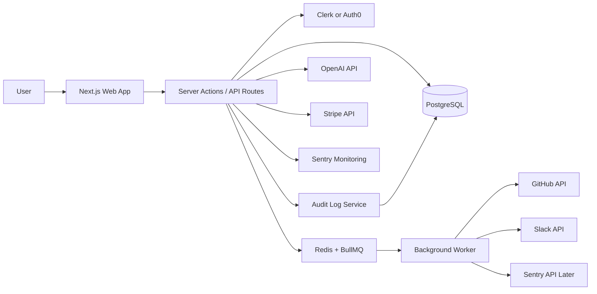
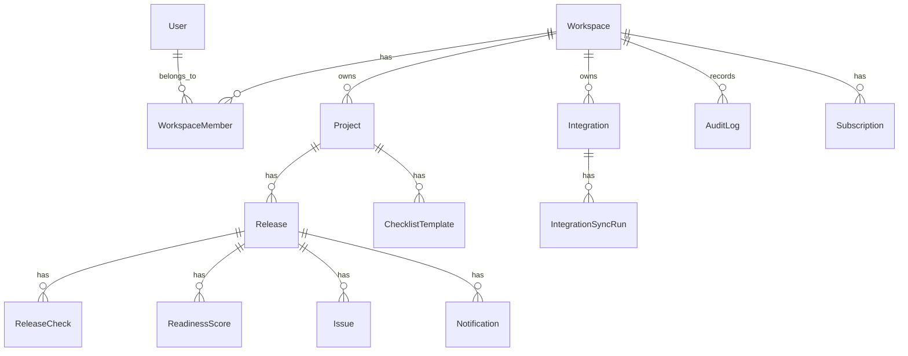
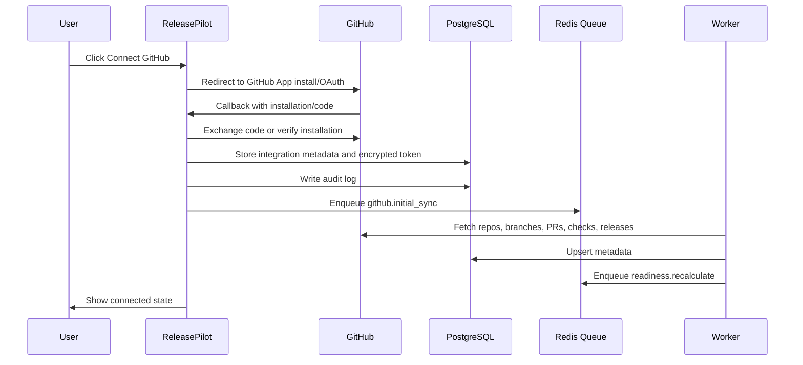
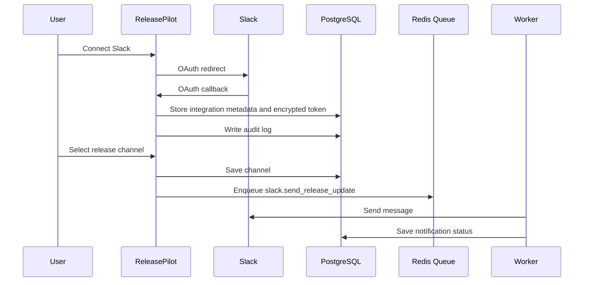
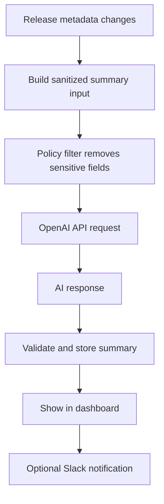
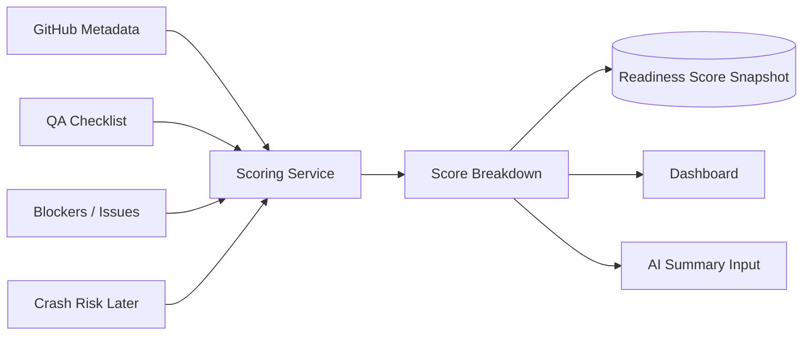
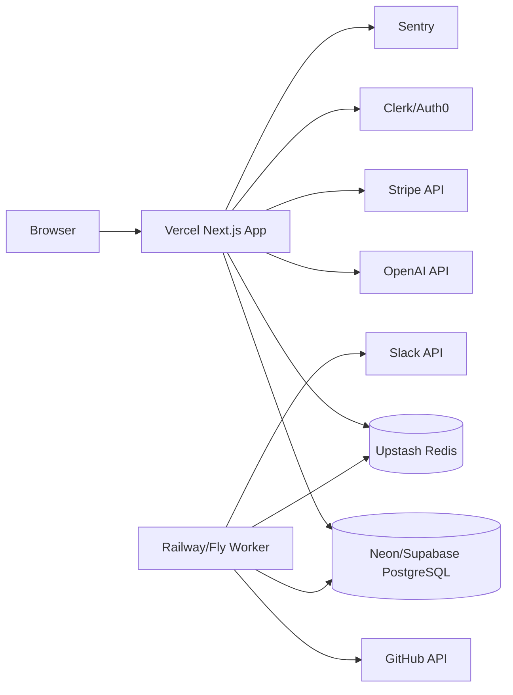

# ReleasePilot System Design Document

Version: 1.0  
Date: June 30, 2026  
Status: MVP planning draft

## 1. System Overview

ReleasePilot is a B2B SaaS product that helps mobile engineering teams decide whether an iOS, Android, Flutter, or React Native release is safe to ship.

The product collects release signals from GitHub, CI checks, manual QA checklists, Slack, and later Sentry/Crashlytics, Jira/Linear, App Store Connect, and Google Play Console. It converts those signals into an explainable release readiness score, a release dashboard, Slack updates, and an AI-generated release summary.

The MVP must be simple enough for a solo founder to build and maintain, while still being secure enough for teams to trust with integration access.

Recommended MVP architecture:

- Next.js full-stack application
- TypeScript
- Tailwind CSS
- PostgreSQL
- Prisma ORM
- Clerk or Auth0 for authentication
- Redis + BullMQ for background jobs
- OpenAI API for AI summaries
- Stripe for billing
- Sentry for application monitoring
- Vercel for web app hosting
- Neon/Supabase for PostgreSQL
- Upstash for Redis

Core rule:

> ReleasePilot does not store source code and does not make final release decisions. It provides release intelligence, explainable signals, and recommendations.

## 2. Goals

The MVP system should:

- Allow users to sign up and create a workspace.
- Allow users to create mobile projects.
- Allow users to connect GitHub with minimum OAuth permissions.
- Sync GitHub repository metadata, pull requests, branches, tags, releases, and CI/check statuses.
- Let users create manual QA checklists.
- Calculate a release readiness score from 0-100.
- Show a clear release dashboard with blockers, status, score, and recommended next actions.
- Send Slack notifications for release status and blockers.
- Generate AI release summaries using sanitized release metadata.
- Maintain audit logs for important security and workspace events.
- Support Stripe billing and plan limits.
- Keep the architecture clean enough to grow without rewriting the MVP.

## 3. Non-Goals

The MVP will not:

- Compete feature-for-feature with enterprise mobile release platforms.
- Use microservices.
- Use Kubernetes.
- Store source code.
- Build a full CI/CD platform.
- Replace GitHub Actions, Bitrise, Codemagic, Jenkins, or CircleCI.
- Replace Sentry, Firebase Crashlytics, or Instabug.
- Automate final release approval.
- Submit apps to App Store Connect or Google Play.
- Support enterprise SSO in the first version.
- Build a custom billing system.
- Build a custom authentication system.
- Support every integration at launch.

## 4. User Roles

### Workspace Owner

The person who creates the workspace. Usually a founder, engineering manager, agency owner, or release manager.

Permissions:

- Manage workspace settings.
- Manage billing.
- Connect and remove integrations.
- Invite and remove members.
- View audit logs.
- Manage projects and releases.

### Admin

A trusted team member who can manage most workspace operations.

Permissions:

- Manage projects.
- Manage releases.
- Configure checklists.
- Connect integrations if allowed by workspace policy.
- View audit logs.

### Release Manager

The person responsible for release coordination.

Permissions:

- Create and update releases.
- Update release checklist.
- Review readiness score.
- Send Slack notifications.
- Generate AI summary.

### Developer

A mobile engineer contributing release work.

Permissions:

- View dashboards.
- Update assigned checklist items.
- View blockers and GitHub status.

### Viewer

A read-only user, such as product manager or stakeholder.

Permissions:

- View dashboard and release details.
- Cannot change integration, billing, or checklist state.

## 5. High-Level Architecture



The MVP should be a modular monolith:

- One codebase.
- One database.
- Clear internal modules.
- Background workers for long-running integration tasks.
- No distributed services unless usage proves they are needed.

## 6. Module Boundaries

Recommended module structure:

```text
src/
  app/
    (marketing)/
    (auth)/
    (dashboard)/
    api/
  components/
    ui/
    dashboard/
    releases/
    integrations/
    checklist/
  modules/
    auth/
    workspaces/
    projects/
    integrations/
    github/
    slack/
    releases/
    checklist/
    scoring/
    ai/
    billing/
    audit/
    notifications/
  server/
    db/
    jobs/
    security/
    config/
  lib/
    errors/
    logger/
    validators/
```

Module responsibilities:

| Module | Responsibility |
| --- | --- |
| auth | User identity, session checks, role guards |
| workspaces | Workspace creation, membership, roles |
| projects | Mobile app projects and platform metadata |
| integrations | Shared integration model, connection status, token references |
| github | GitHub OAuth, repository sync, PR/check metadata |
| slack | Slack OAuth, channel selection, notifications |
| releases | Release versions, release state, release history |
| checklist | Manual QA checklist templates and item completion |
| scoring | Readiness score calculation and breakdown |
| ai | AI summary prompt building and response storage |
| billing | Stripe customer, subscription, plan limits |
| audit | Security and business event logging |
| notifications | Notification dispatch and retry logic |

Boundary rule:

> UI components must not contain business logic. Business logic belongs in modules and server services.

## 7. Frontend Architecture

Frontend stack:

- Next.js App Router
- TypeScript
- Tailwind CSS
- shadcn/ui or similar component primitives
- React Hook Form for forms
- Zod for validation
- TanStack Query only if client-side server state becomes complex

Primary frontend areas:

### Public Marketing

Pages:

- Home/landing page
- Pricing
- Security
- Waitlist/beta signup

### Authentication

Pages:

- Sign in
- Sign up
- Organization/workspace onboarding

### App Dashboard

Main navigation:

- Dashboard
- Releases
- Checklist
- Integrations
- AI Insights
- Audit Logs
- Team
- Billing
- Settings

### UI Principles

- Work-focused dashboard, not a decorative landing-page style.
- Clear status colors for success, warning, blocked, neutral.
- Every empty state should tell the user what to do next.
- Every integration screen should clearly explain requested permissions.
- Readiness score must always show a breakdown.
- AI summary must show source signals and should be labeled as a recommendation.

### Key Screens

| Screen | Purpose |
| --- | --- |
| Dashboard | Current release readiness, blockers, CI, QA, AI summary |
| Release detail | Full release breakdown and activity |
| Checklist | Manual QA/release checklist management |
| Integrations | Connect GitHub, Slack, and later Sentry/Jira |
| AI Insights | Summaries, risk explanation, next actions |
| Audit Logs | Security and workspace events |
| Team | Members and roles |
| Billing | Current plan, usage, upgrade |
| Settings | Workspace/project configuration |

## 8. Backend Architecture

The MVP backend should start inside the Next.js application using server actions and route handlers. This avoids unnecessary infrastructure and lets a solo founder move quickly.

Backend responsibilities:

- Validate all user actions.
- Enforce workspace membership and role checks.
- Manage database reads/writes through Prisma.
- Store encrypted integration tokens.
- Enqueue background sync jobs.
- Calculate readiness scores.
- Generate AI summaries from sanitized metadata.
- Send Slack notifications through jobs.
- Create audit logs for important actions.
- Enforce subscription limits.

Recommended backend style:

- Use service functions per module.
- Use Zod schemas for input validation.
- Use explicit authorization checks in server functions.
- Use typed errors for predictable UI messages.
- Keep external API logic isolated in provider clients.

Example service boundary:

```text
modules/releases/
  release.service.ts
  release.repository.ts
  release.types.ts
  release.validators.ts
```

Later extraction path:

If the backend grows too large, extract the service layer into a NestJS API. The Prisma schema, module boundaries, and business logic structure should make that possible without a total rewrite.

## 9. Database Design Overview

Database:

- PostgreSQL
- Prisma ORM
- UUID primary keys
- Timestamps on all core tables
- Workspace ID on all customer-owned tables
- Soft deletion for customer-facing entities where useful
- Audit logs should be append-only

Core entities:



Suggested tables:

| Table | Purpose |
| --- | --- |
| users | App user profile mapped to auth provider |
| workspaces | Customer/team boundary |
| workspace_members | User membership and role |
| projects | Mobile apps/repos tracked by workspace |
| integrations | GitHub/Slack/Sentry connection metadata |
| integration_tokens | Encrypted OAuth tokens and refresh data |
| integration_sync_runs | Sync attempts, status, errors |
| releases | Version/build being evaluated |
| release_checks | Manual or automated readiness checks |
| checklist_templates | Reusable checklist definitions |
| readiness_scores | Score snapshots and category breakdown |
| issues | Blockers, bugs, PR risks, crash risks |
| notifications | Slack/email notification events |
| ai_summaries | AI release summaries and prompt metadata |
| audit_logs | Security and business events |
| subscriptions | Stripe customer/subscription state |

Important data rule:

> Store GitHub metadata, not source code.

Allowed GitHub metadata:

- Repository name and ID
- Branch names
- Pull request title, number, state, author, labels, merge status
- Commit SHA references
- Check run status and conclusion
- Tags/releases
- Workflow/check names and timestamps

Avoid storing:

- Repository file contents
- Full diffs
- Secrets
- Environment variables
- Private source code

## 10. Integration Architecture

Integrations should use a shared integration model plus provider-specific modules.

Integration states:

- not_connected
- connecting
- connected
- needs_reauth
- rate_limited
- failing
- disabled

Common integration fields:

- workspace_id
- provider
- external_account_id
- display_name
- scopes
- status
- connected_by_user_id
- last_sync_at
- last_error

Provider-specific modules:

- GitHub integration for repository metadata.
- Slack integration for notifications.
- Sentry integration later for crash risk.
- Jira/Linear later for issue tracking.
- App Store Connect/Google Play later for store readiness.

Integration design rules:

- Each provider client should be isolated.
- Provider API failures should not crash dashboard pages.
- Sync jobs should be idempotent.
- Rate limits should be visible in integration health.
- Reauthorization should be clear and actionable.

## 11. GitHub OAuth And Sync Flow

GitHub should be the first integration because it gives release metadata, PR status, branch status, and CI checks.

Minimum GitHub permissions should be requested. For the MVP, prefer GitHub App installation over broad OAuth when possible because GitHub Apps can be scoped per repository.

Recommended GitHub App permissions:

- Repository metadata: read
- Pull requests: read
- Checks: read
- Commit statuses: read
- Actions/workflows: read only if needed
- Contents: avoid if possible

OAuth/sync flow:



GitHub sync jobs:

- github.initial_sync
- github.refresh_repository
- github.refresh_pull_requests
- github.refresh_checks
- github.refresh_releases
- github.handle_rate_limit

Sync strategy:

- Initial sync after connection.
- Scheduled refresh every 10-30 minutes for active projects.
- Manual refresh button with cooldown.
- Webhooks later if needed.

## 12. Slack Notification Flow

Slack is used to notify release channels about readiness, blockers, and summary updates.

Slack MVP capabilities:

- Connect Slack workspace.
- Select release channel.
- Send release readiness summary.
- Send blocker notification.
- Send "release ready" notification.

Slack permissions:

- channels:read or conversations:read as needed
- chat:write
- team:read if needed for workspace display

Flow:



Slack message should include:

- Release version
- Readiness score
- Ship/wait/fix recommendation
- Top blockers
- QA status
- CI status
- Link to ReleasePilot dashboard

## 13. AI Summary Flow

AI should assist the release manager. It should not approve releases.

AI input should use sanitized metadata only:

- Release version
- Platform
- Readiness score breakdown
- CI status
- Checklist status
- PR titles and statuses
- Blocker labels and severity
- Crash counts if available later
- Recent activity summary

AI should not receive:

- Source code
- Secrets
- Full diffs
- Private file contents
- OAuth tokens

Flow:



AI output should include:

- Release summary
- Main risks
- Recommended next actions
- Confidence caveat
- Source signals used

Required UI label:

> AI summary is advisory. Final release decisions remain with your team.

## 14. Readiness Scoring Flow

The readiness score must be explainable and adjustable later.

Default MVP score:

| Category | Points | Source |
| --- | ---: | --- |
| CI/build status | 25 | GitHub checks |
| QA completion | 20 | Manual checklist |
| Crash risk | 15 | Manual MVP or Sentry later |
| Open blockers | 15 | Manual checklist/issues |
| Unresolved PRs | 10 | GitHub PRs |
| Release notes | 10 | Manual check |
| Store readiness | 5 | Manual check |

Flow:



Score outputs:

- total_score
- status: ready, warning, blocked, unknown
- category_scores
- blockers
- calculated_at
- source_versions

Recommendation mapping:

| Score | Blocking Condition | Recommendation |
| ---: | --- | --- |
| 90-100 | None | Ship |
| 70-89 | No critical blockers | Review then ship |
| 50-69 | Some risk | Wait |
| 0-49 | Any major risk | Fix blockers |
| Any | Critical blocker exists | Fix blockers |

Critical blocker override:

Even if total score is high, a critical blocker should force the recommendation to "Fix blockers."

## 15. Background Jobs

Background jobs keep the UI fast and handle integration work reliably.

Use:

- Redis
- BullMQ
- Separate worker process

Job types:

| Job | Purpose |
| --- | --- |
| github.initial_sync | Fetch repository data after connection |
| github.refresh_project | Refresh selected project metadata |
| github.refresh_checks | Refresh CI/check status |
| readiness.recalculate | Recalculate release score |
| ai.generate_release_summary | Generate AI summary after score update |
| slack.send_release_update | Send release status message |
| billing.sync_subscription | Sync Stripe subscription state |
| integrations.health_check | Check integration status |
| audit.cleanup_or_archive | Archive older audit export views if needed later |

Job rules:

- Jobs must be idempotent.
- Jobs should record status and errors.
- Failed jobs should retry with backoff.
- Rate-limited jobs should pause provider-specific sync.
- Jobs should never log tokens or secrets.

## 16. Security Model

Security is a product feature for ReleasePilot.

Core security principles:

- Least privilege.
- Metadata only.
- Encrypted tokens.
- Workspace data isolation.
- Auditability.
- Transparent AI usage.
- Clear data deletion.

Security controls:

- Use Clerk/Auth0 for authentication.
- Enforce role-based authorization on every server action/API route.
- Encrypt OAuth tokens before storage.
- Store secrets only in environment variables or managed secret stores.
- Never expose provider tokens to the frontend.
- Keep audit logs for integration changes, role changes, billing changes, and release status changes.
- Validate all inputs with Zod.
- Use CSRF-safe patterns supported by the framework/auth provider.
- Apply rate limits to sensitive routes.
- Add security headers.

Audit events:

- user.signed_in
- workspace.created
- member.invited
- member.role_changed
- integration.connected
- integration.disconnected
- integration.reauthorized
- release.created
- release.score_recalculated
- notification.sent
- billing.updated
- workspace.deleted

## 17. Token Encryption

OAuth tokens must be encrypted at rest.

Recommended approach:

- Use envelope encryption if available through hosting/cloud provider.
- For MVP, use strong symmetric encryption with a server-side key stored in environment variables.
- Use AES-256-GCM or a vetted library.
- Store nonce/iv and auth tag with the encrypted payload.
- Rotate encryption keys later with versioned keys.

Token storage design:

| Field | Purpose |
| --- | --- |
| integration_id | Parent integration |
| provider | github/slack/sentry |
| token_ciphertext | Encrypted token |
| refresh_token_ciphertext | Encrypted refresh token if provider uses one |
| expires_at | Token expiry |
| scopes | Granted scopes |
| key_version | Encryption key version |
| created_at | Creation time |
| updated_at | Update time |

Token rules:

- Never send tokens to the frontend.
- Never log raw tokens.
- Never include tokens in AI prompts.
- Never store tokens in browser local storage.
- Delete tokens when integration is disconnected.

## 18. Workspace Data Isolation

Every customer-owned row should include workspace_id unless it is a global reference table.

Isolation rules:

- Every query must be scoped to the active workspace.
- Every mutation must verify user membership and role.
- A user can belong to many workspaces, but only one active workspace is used per request.
- Background jobs must include workspace_id and validate integration ownership before running.
- Audit logs must include workspace_id.

Recommended authorization helper:

```text
requireWorkspaceRole({
  userId,
  workspaceId,
  allowedRoles: ["owner", "admin", "release_manager"]
})
```

Never rely only on frontend route protection. Server-side authorization is mandatory.

## 19. Error Handling

Error handling must be explicit because integrations will fail.

Error categories:

- validation_error
- unauthorized
- forbidden
- not_found
- integration_auth_error
- integration_rate_limited
- integration_provider_error
- billing_error
- ai_provider_error
- internal_error

User-facing error principles:

- Explain what happened.
- Explain what the user can do next.
- Avoid exposing internal stack traces.
- Show integration health clearly.
- Allow reauthorization when token issues occur.

Examples:

| Situation | UI Message |
| --- | --- |
| GitHub token expired | GitHub needs to be reconnected to refresh release data. |
| GitHub rate limit | GitHub sync is paused temporarily. We will retry automatically. |
| Slack channel missing | Select a valid Slack channel before sending release updates. |
| AI unavailable | AI summary is temporarily unavailable. Release signals are still visible. |
| Billing inactive | Upgrade or reactivate billing to add more projects. |

## 20. Monitoring And Logging

Use Sentry for error monitoring from day one.

Monitor:

- Frontend runtime errors
- Backend route/server action errors
- Worker job failures
- Integration sync failures
- AI API failures
- Stripe webhook failures
- Slow dashboard queries

Logging principles:

- Use structured logs.
- Include request_id, workspace_id, user_id where safe.
- Never log tokens, secrets, raw OAuth payloads, or sensitive prompt data.
- Log provider error codes and retry status.

Operational dashboards later:

- Active workspaces
- Connected integrations
- Sync job success rate
- Average dashboard load time
- Failed Slack notifications
- AI summary failure rate
- Stripe webhook health

## 21. Deployment Architecture

Recommended MVP deployment:



Deployment components:

- Web app: Vercel
- Database: Neon or Supabase Postgres
- Redis: Upstash
- Worker: Railway, Fly.io, or Render
- Auth: Clerk or Auth0
- Monitoring: Sentry
- Payments: Stripe

Environment variables:

- DATABASE_URL
- REDIS_URL
- AUTH_SECRET / Clerk/Auth0 keys
- GITHUB_APP_ID
- GITHUB_CLIENT_ID
- GITHUB_CLIENT_SECRET
- GITHUB_PRIVATE_KEY
- SLACK_CLIENT_ID
- SLACK_CLIENT_SECRET
- OPENAI_API_KEY
- STRIPE_SECRET_KEY
- STRIPE_WEBHOOK_SECRET
- TOKEN_ENCRYPTION_KEY
- SENTRY_DSN

## 22. Local Development Setup

Local tools:

- Node.js LTS
- pnpm
- PostgreSQL local or remote dev database
- Redis local or Upstash dev database
- GitHub App dev credentials
- Slack App dev credentials
- Stripe CLI

Suggested setup steps:

```text
1. Create Next.js app with TypeScript.
2. Add Tailwind CSS and component library.
3. Add Prisma and connect PostgreSQL.
4. Add auth provider.
5. Create workspace/project schema.
6. Add GitHub integration models.
7. Add encrypted token helper.
8. Add BullMQ worker setup.
9. Add release/checklist/scoring modules.
10. Add Slack integration.
11. Add AI summary module.
12. Add Stripe billing.
13. Add Sentry monitoring.
```

Local commands after implementation:

```bash
pnpm install
pnpm prisma migrate dev
pnpm dev
pnpm worker:dev
pnpm lint
pnpm test
```

## 23. MVP Limitations

The MVP intentionally has limits:

- GitHub and Slack first; other integrations later.
- Sentry may be optional/private beta.
- App Store Connect and Google Play are not in MVP.
- Manual store readiness check instead of automated store integration.
- Manual QA checklist instead of full QA test management.
- Basic role model instead of enterprise permission engine.
- Basic Stripe plans instead of custom billing.
- Scheduled sync first; webhooks later if needed.
- AI summary only from metadata, not code.

These limitations keep the product focused and reduce security risk.

## 24. Future Scalability

Scale only when usage proves the need.

Future improvements:

- Add GitHub webhooks for faster sync.
- Add Sentry and Firebase Crashlytics integrations.
- Add Jira/Linear issue mapping.
- Add App Store Connect and Google Play status.
- Add configurable scoring weights.
- Add release templates by app type.
- Add enterprise SSO.
- Add audit log exports.
- Add data retention settings.
- Add SOC 2 readiness controls.
- Move backend into NestJS if the service layer outgrows Next.js.
- Move workers into dedicated services if job volume grows.

Potential later architecture:

- Next.js frontend
- NestJS backend API
- Dedicated worker service
- PostgreSQL primary database
- Redis queue/cache
- Webhook ingestion service

Do not move to this until the MVP has real customers and operational pressure.

## 25. What To Avoid

Avoid these in the MVP:

- Microservices.
- Kubernetes.
- Kafka or heavy event streaming.
- Custom authentication.
- Custom billing.
- Full enterprise RBAC.
- Full release automation.
- App Store/Google Play submission automation.
- Storing source code.
- Requesting broad OAuth permissions.
- Sending sensitive data to AI.
- Building every integration at once.
- Hiding the scoring logic.
- Letting UI components own business logic.
- Building for enterprise procurement before small teams adopt the product.
- Changing the MVP scope during development without strong validation.

Development principle:

> Make product and architecture changes before coding. During development, protect the agreed MVP scope. New ideas go to the backlog unless they fix security, prove customer value, or unblock the release-readiness workflow.

